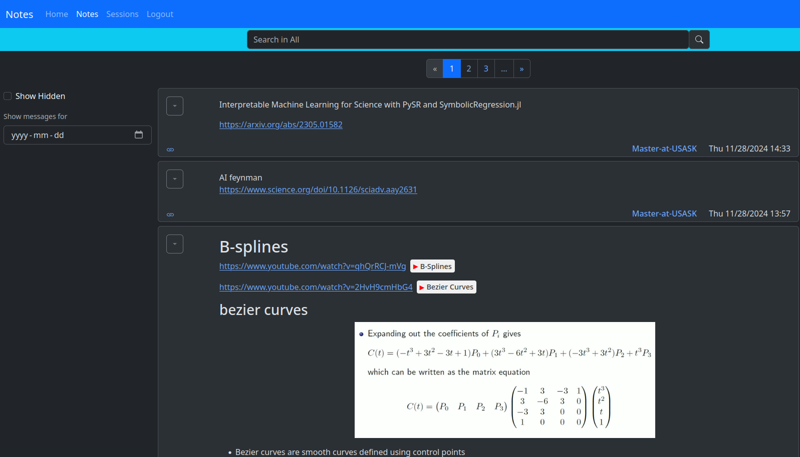

# Notes API



## Quick Start Guide

1. Create a `.env` file in the root directory with the following variables:
```env
MINIO_ROOT_USER=your_minio_username
MINIO_ROOT_PASSWORD=your_minio_password
DOMAIN_NAME=your_domain
```

2. Start the application:
```bash
docker compose up
```

That's it! The application will be up and running with all required services.